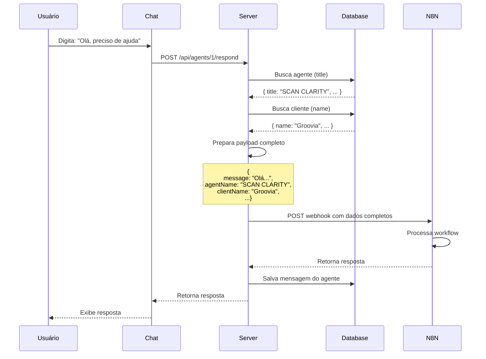

# 🎉 Integração N8N Atualizada - Dados Completos do Chat

**Data:** 2025-01-27  
**Status:** ✅ Implementado e Atualizado

---

## 🔄 Mudanças Realizadas

### 1. Webhook URL Atualizada

**ANTES:**
```
https://capsuladev-n8n.jv4bim.easypanel.host/webhook-test/ENTRADA-DADOS
```

**AGORA:**
```
https://capsuladev-n8n.jv4bim.easypanel.host/webhook/ENTRADA-DADOS
```

---

### 2. Payload Ampliado com Dados Completos

#### ANTES (dados básicos):
```json
{
  "message": "Olá",
  "userId": 1,
  "agentId": 1,
  "conversationId": 123,
  "timestamp": "2025-01-27T00:00:00.000Z"
}
```

#### AGORA (dados completos):
```json
{
  "message": "Olá, preciso de ajuda",
  "agentName": "SCAN CLARITY",
  "clientName": "Groovia",
  "userId": 1,
  "agentId": 1,
  "conversationId": 123,
  "timestamp": "2025-01-27T00:00:00.000Z"
}
```

---

### 3. Novos Campos Adicionados

| Campo | Descrição | Fonte |
|-------|-----------|-------|
| `message` | Texto da mensagem do usuário | Input do usuário |
| **`agentName`** ✨ | Nome/título do agente | Campo `title` da tabela `agents` |
| **`clientName`** ✨ | Nome do cliente/organização | Campo `name` da tabela `clients` |
| `userId` | ID do usuário | Headers/Session |
| `agentId` | ID do agente | Parâmetro da URL |
| `conversationId` | ID da conversa | Request body |
| `timestamp` | Data/hora em ISO 8601 | Gerado automaticamente |

---

## 📝 Arquivos Modificados

### 1. `server/n8nService.ts`

**Mudanças:**
- ✅ URL do webhook atualizada
- ✅ Interface `N8NPayload` ampliada com `agentName` e `clientName`
- ✅ Método `processMessage()` agora aceita e envia os novos campos

### 2. `server/index.ts`

**Mudanças:**
- ✅ Busca informações do agente (`agent.title`)
- ✅ Busca informações do cliente (`client.name`)
- ✅ Envia todos os dados para o N8N
- ✅ Logs detalhados mostrando todos os dados enviados

### 3. `INTEGRACAO_N8N.md`

**Mudanças:**
- ✅ Documentação atualizada com novo payload
- ✅ Novo webhook URL documentado
- ✅ Descrição dos novos campos

---

## 🔄 Fluxo Atualizado



---

## 📊 Exemplo de Dados Enviados

### Request para N8N:
```json
{
  "message": "Como posso melhorar minha estratégia de marketing?",
  "agentName": "SCAN CLARITY",
  "clientName": "Groovia",
  "userId": 1,
  "agentId": 1,
  "conversationId": 45,
  "timestamp": "2025-01-27T14:30:00.000Z"
}
```

### Logs do Servidor:
```
🤖 Processando resposta do agente 1
📨 Mensagem: Como posso melhorar minha estratégia de marketing?
🔑 clientId: 1
📋 Dados completos: {
  agentName: 'SCAN CLARITY',
  clientName: 'Groovia',
  message: 'Como posso melhorar minha estratégia de marketing?',
  userId: 1,
  agentId: 1,
  conversationId: 45
}
📤 Enviando para N8N...
✅ Resposta do N8N: { message: "Workflow was started" }
✅ Resposta do N8N processada com sucesso
```

---

## 🧪 Como Testar

### 1. Reiniciar o Servidor

```bash
# Ctrl+C no terminal do servidor (se estiver rodando)
npm run server:no-telemetry
```

### 2. Abrir o Chat

1. Acesse http://localhost:5000
2. Clique em um agente para abrir o chat
3. Digite uma mensagem: "Olá, testando integração com N8N"

### 3. Verificar Logs

No terminal do servidor, você verá:

```
📋 Dados completos: {
  agentName: 'Nome do Agente',
  clientName: 'Nome do Cliente',
  message: 'Olá, testando integração com N8N',
  ...
}
📤 Enviando para N8N: { 
  webhook: 'https://capsuladev-n8n.jv4bim.easypanel.host/webhook/ENTRADA-DADOS',
  payload: {
    message: '...',
    agentName: '...',
    clientName: '...',
    ...
  }
}
✅ Resposta do N8N: { message: "Workflow was started" }
```

---

## 🎯 Benefícios da Atualização

### Para o N8N
✅ **Contexto completo** - Nome do agente e cliente disponíveis  
✅ **Workflows inteligentes** - Pode personalizar respostas por cliente  
✅ **Auditoria** - Know which client/agent triggered workflow  
✅ **Estatísticas** - Tracking por agente e por cliente  

### Para o Sistema
✅ **Melhor UX** - Responses mais contextualizadas  
✅ **Rastreabilidade** - Todos os dados no payload  
✅ **Debugging** - Logs detalhados mostram tudo  
✅ **Extensibilidade** - Fácil adicionar novos campos  

---

## 🔮 Próximos Passos (Sugestões)

1. **Formatação de Resposta no N8N**
   - Configurar workflow para retornar resposta formatada
   - Adicionar markdown support
   - Incluir ações/buttons na resposta

2. **Campos Adicionais**
   - `userName`: Nome do usuário
   - `userEmail`: Email do usuário
   - `agentType`: Tipo do agente
   - `previousMessages`: Histórico da conversa

3. **Tratamento de Erros**
   - Retry automático em caso de falha
   - Timeout configurável
   - Fallback para resposta padrão

---

## ✅ Checklist de Validação

- [x] Webhook URL atualizada corretamente
- [x] Payload inclui `agentName`
- [x] Payload inclui `clientName`
- [x] Endpoint busca dados do banco
- [x] Logs mostram todos os dados
- [x] Documentação atualizada
- [x] Sem erros de lint
- [ ] Testado com workflow real no N8N

---

**Status Final:** ✅ **Todas as mudanças implementadas e documentadas!**

**Próximo passo:** Testar com workflow real no N8N que processe os dados completos do chat.

