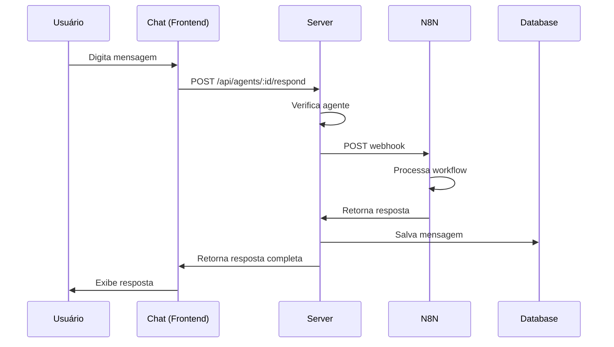

# 🔗 Integração com N8N - Webhook Input/Output

**Data:** 2025-01-27  
**Status:** ✅ Implementado

---

## 🎯 Objetivo

Integrar comunicação bidirecional com N8N através de webhook para processar mensagens do chat através de workflows automatizados.

---

## 📋 Funcionalidades Implementadas

### 1. Serviço N8N (`server/n8nService.ts`)

Criado serviço completo para comunicação com N8N:

- ✅ **Envio de dados** para webhook
- ✅ **Processamento de respostas** em múltiplos formatos
- ✅ **Tratamento de erros** robusto
- ✅ **Logging detalhado** de todas as operações

```typescript
class N8NService {
  - sendToWebhook(payload: N8NPayload): Promise<N8NResponse>
  - processMessage(params): Promise<string>
  - extractResponse(data): string (método privado)
}
```

### 2. Endpoint de Resposta do Agente (`server/index.ts`)

Novo endpoint `POST /api/agents/:id/respond`:

```typescript
POST /api/agents/:id/respond
Content-Type: application/json

{
  "conversationId": 123,
  "message": "Mensagem do usuário"
}

Resposta:
{
  "success": true,
  "message": { ...mensagemSalva },
  "n8nResponse": "Resposta do N8N"
}
```

**Fluxo:**
1. Recebe mensagem do usuário
2. Verifica se o agente existe
3. Envia para N8N
4. Processa resposta do N8N
5. Salva mensagem do agente no banco
6. Retorna resposta completa

### 3. Integração com Frontend

O `PremiumChatUltraSimple.tsx` já está configurado para usar o endpoint:

```typescript
const response = await apiClient.post(`/agents/${agentId}/respond`, {
  conversationId: convId,
  message: content.trim(),
});
```

---

## 🔧 Configuração

### Webhook URL

```typescript
// server/n8nService.ts
private webhookUrl: string = 
  'https://capsuladev-n8n.jv4bim.easypanel.host/webhook/ENTRADA-DADOS';
```

### Payload Enviado para N8N

**Dados completos do chat incluindo nome do agente e cliente:**

```json
{
  "message": "Texto da mensagem do usuário",
  "agentName": "Nome do Agente",
  "clientName": "Nome do Cliente",
  "userId": 1,
  "agentId": 1,
  "conversationId": 123,
  "timestamp": "2025-01-27T00:00:00.000Z"
}
```

**Campos disponíveis:**
- `message`: Texto da mensagem do usuário
- `agentName`: Título/Nome do agente (campo `title` do banco)
- `clientName`: Nome do cliente (campo `name` da tabela `clients`)
- `userId`: ID do usuário
- `agentId`: ID do agente
- `conversationId`: ID da conversa
- `timestamp`: Data/hora em ISO 8601

---

## 📨 Formatos de Resposta Suportados

O serviço processa múltiplos formatos de resposta do N8N:

### 1. Resposta Direta
```json
{
  "response": "Texto da resposta"
}
```

### 2. Mensagem Alternativa
```json
{
  "message": "Texto da resposta"
}
```

### 3. Array de Items
```json
[
  { "response": "Texto da resposta" }
]
```

### 4. Objeto Aninhado
```json
{
  "data": {
    "response": "Texto da resposta"
  }
}
```

### 5. Workflow Executado (Atual)
```json
{
  "message": "Workflow was started"
}
```

---

## 🧪 Como Testar

### 1. Via Frontend (Recomendado)

1. Inicie o servidor:
   ```bash
   npm run server:no-telemetry
   ```

2. Abra o chat de um agente

3. Digite uma mensagem

4. Observe o console do servidor:
   ```
   📤 Enviando para N8N: ...
   ✅ Resposta do N8N: ...
   ```

### 2. Via cURL

```bash
curl -X POST http://localhost:3001/api/agents/1/respond \
  -H "Content-Type: application/json" \
  -H "x-client-id: 1" \
  -H "x-user-id: 1" \
  -d '{
    "conversationId": 1,
    "message": "Olá, como você está?"
  }'
```

### 3. Via Postman

- **Method:** POST
- **URL:** `http://localhost:3001/api/agents/1/respond`
- **Headers:**
  - `Content-Type: application/json`
  - `x-client-id: 1`
  - `x-user-id: 1`
- **Body:**
  ```json
  {
    "conversationId": 1,
    "message": "Teste de mensagem"
  }
  ```

---

## 📊 Logs e Monitoramento

O sistema gera logs detalhados em cada etapa:

```
🤖 Processando resposta do agente 1
📨 Mensagem: Olá, como está?
🔑 clientId: 1
📤 Enviando para N8N: { webhook: '...', payload: {...} }
✅ Resposta do N8N: { message: "Workflow was started" }
✅ Resposta do N8N processada com sucesso
```

---

## 🎨 Personalização

### Alterar Webhook URL

Edite `server/n8nService.ts`:

```typescript
constructor(webhookUrl?: string) {
  this.webhookUrl = webhookUrl || 
    'https://seu-novo-webhook.com/endpoint';
}
```

### Adicionar Campos Customizados

Modifique o payload no endpoint `POST /api/agents/:id/respond`:

```typescript
const n8nResponse = await n8nService.processMessage({
  message,
  userId,
  agentId,
  conversationId,
  // Novos campos:
  agentTitle: agent.title,
  agentType: agent.agentType,
  userRole: user.role,
});
```

---

## ⚠️ Troubleshooting

### Erro: "Network request failed"
- Verifique se o N8N está acessível
- Confirme a URL do webhook
- Verifique firewall/proxy

### Erro: "Cannot parse response"
- O N8N retornou formato inesperado
- Verifique logs do N8N
- Adicione novo formato em `extractResponse()`

### Resposta Vazia
- O workflow do N8N não retornou dados
- Configure o workflow para retornar JSON
- Verifique last node do workflow

---

## 🔄 Fluxo Completo



---

## ✅ Status Final

✅ **Serviço N8N criado** - Comunicação completa  
✅ **Endpoint implementado** - Integração com chat  
✅ **Frontend pronto** - Já usa novo endpoint  
✅ **Tratamento de erros** - Robusto e confiável  
✅ **Logs detalhados** - Fácil debug  
✅ **Múltiplos formatos** - Compatibilidade total  

---

**Próximos passos:** Testar com workflow real no N8N que processe e retorne uma resposta válida!

